# HI! GEBODIKBD — Educational Relational DBMS (Java 17)

Russian version: `README.ru.md`.

GEBODIKBD is an educational project: a minimal relational DBMS with a client–server architecture, a custom SQL pipeline, and disk-backed storage (heap pages + buffer pool).
The main goal is to make the full query path tangible — from a SQL string to page reads/writes and index usage.

> This project is intentionally simplified and not intended for production use. The focus is on core DBMS concepts and a readable implementation.

## Project goals

The initial motivation came from a university databases course (HSE University): it provided the theoretical foundation and classic DBMS building blocks, but I wanted to understand **how those concepts work in practice** — at the level of code, data formats, and real engineering trade-offs.

Over time, the learning goal evolved into a small research-style effort: build a minimal yet coherent relational database “analogue” where the full processing pipeline is visible end-to-end — from parsing and planning down to page-level storage and indexing — and observe how each subsystem impacts architecture and performance.

This project focuses on:

- The SQL pipeline: lexer → parser → semantic analysis → planning → optimization → execution
- The storage engine: heap pages, tuple identifiers (TID), serialization, buffer pool, and eviction strategies
- Indexes and plan selection (sequential scan vs index scan)
- Engineering practice: modular design, APIs, unit/e2e tests, and Java networking/I/O

## Quick start

### Requirements

- Java 17+
- Gradle Wrapper (included)

### Start the server

```bash
./run-server.sh
```

You can configure the server via environment variables:

```bash
PORT=15432 DATA_DIR=data BUFFER_POOL=10 ./run-server.sh
```

### Run the CLI client

```bash
./run-cli.sh
```

You can configure the client via environment variables:

```bash
HOST=127.0.0.1 PORT=15432 ./run-cli.sh
```

## Implemented

- [x] Client–server: TCP framed protocol, JSON responses, CLI client
- [x] SQL dialect: `CREATE TABLE`, `INSERT`, `SELECT`, `CREATE INDEX`
- [x] Expressions in `SELECT` and `WHERE`: arithmetic, comparisons, `AND`/`OR`, aliases via `AS`
- [x] Query compilation: `LexerImpl`, `ParserImpl`, `SemanticAnalyzerImpl`, `PlannerImpl`, `OptimizerImpl`
- [x] Execution: Volcano-style executors (scan/filter/project/insert/create)
- [x] Disk storage: 8KB heap pages, page file manager, tuple serializer
- [x] Buffer pool: page cache, dirty pages, LRU/Clock eviction strategies
- [x] System catalog: table/column/type/index metadata stored under `data/`
- [x] Indexes:
  - [x] `HASH` — persistent, used for point lookups (`=`)
  - [x] `BTREE` (B+Tree) — range scans supported; currently rebuilt on startup (see limitations)
- [x] Test suite: lexer/parser/semantic, storage, indexes, end-to-end over TCP

## Roadmap / TODO

- [ ] `BTREE` persistence (on-disk format + recovery without rebuild)
- [ ] `DELETE` / `UPDATE`
- [ ] `DROP TABLE` / `DROP INDEX`
- [ ] Transactions and concurrency (remove global server lock, add an isolation model)
- [ ] Better optimizer (statistics, cost-based planning)
- [ ] SQL extensions (JOIN, ORDER BY, LIMIT)

Full list: `docs/ROADMAP.md`.

## Architecture

High-level component diagram:

```mermaid
flowchart LR
  subgraph Client["Client"]
    CLI["CLI client\nru.open.cu.student.client.CliMain"]
  end

  subgraph Network["Network"]
    FP["FramedProtocol\n(length-prefixed)"]
  end

  subgraph Server["Server"]
    SRV["DbServer\nru.open.cu.student.server.DbServer"]
    SES["DbSession\n(1 connection)"]
    PIPE["SqlPipeline"]
    QEE["QueryExecutionEngine"]
  end

  subgraph Compiler["Query compilation"]
    LEX["LexerImpl"]
    PAR["ParserImpl"]
    SEM["SemanticAnalyzerImpl"]
    PLN["PlannerImpl"]
    OPT["OptimizerImpl\nRuleBasedScanStrategy"]
    EXF["ExecutorFactoryImpl"]
  end

  subgraph Storage["Storage engine"]
    SE["StorageEngine"]
    CAT["CatalogManager"]
    IDX["IndexManager\n(HASH / BTREE)"]
    BPM["Buffer pools\n(LRU / Clock)"]
    PFM["PageFileManager\n(HeapPageFileManager)"]
    DISK["Disk files\n*.dat, indexes/*"]
  end

  CLI --> FP --> SRV --> SES --> PIPE
  PIPE --> LEX --> PAR --> SEM --> PLN --> OPT --> EXF --> QEE
  QEE --> SE
  SE --> CAT
  SE --> IDX
  SE --> BPM --> PFM --> DISK
  IDX --> DISK
```



Details and rationale: `docs/ARCHITECTURE.md`.

## Examples

Minimal scenario:

```sql
CREATE TABLE users (id INT64, name VARCHAR);
INSERT INTO users VALUES (1, 'Alice');
INSERT INTO users VALUES (2, 'Bob');
SELECT * FROM users WHERE id = 2;

CREATE INDEX idx_users_id ON users(id) USING HASH;
SELECT * FROM users WHERE id = 2;
```

More scenarios: `docs/EXAMPLES.md`.

## Documentation

- `docs/README.md` — documentation index
- `docs/ARCHITECTURE.md` — architecture, diagrams, key decisions
- `docs/PIPELINE.md` — SQL pipeline (lexer/parser/semantic/plans/execution)
- `docs/SQL_DIALECT.md` — supported SQL dialect and limitations
- `docs/STORAGE_ENGINE.md` — heap pages, buffer pool, on-disk layout
- `docs/INDEXES.md` — HASH/BTREE indexes and plan selection rules
- `docs/PROTOCOL.md` — TCP/JSON protocol
- `docs/TECHNICAL_ASSIGNMENT.md` — sample technical assignment / checklist
- `docs/DEVELOPMENT.md` — build, run, configuration

Russian documentation is available under `docs/ru/`.

## Limitations and assumptions

- Concurrency is simplified: queries are serialized via a global server-level lock
- No transactions and no isolation model
- `BTREE` indexes are rebuilt by scanning the table on startup (persistence is a TODO)

## Build and test

```bash
./gradlew build
./gradlew test
```

## License

See `LICENSE`.

## Contributing

See `CONTRIBUTING.md`.


