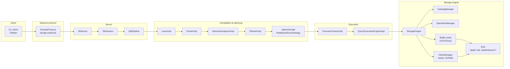
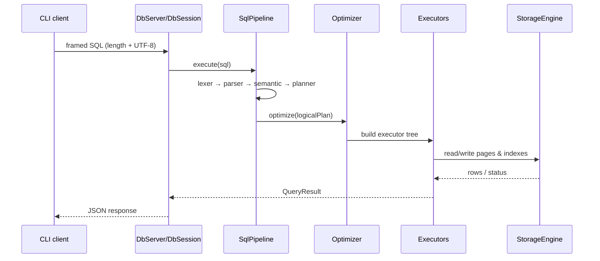

# Архитектура

GEBODIKBD устроен как небольшая учебная СУБД с модульным разделением на:

- клиент (CLI),
- сетевой протокол,
- сервер (сессии и обработка запросов),
- SQL pipeline (компиляция + планирование + оптимизация),
- execution engine (исполнение планов),
- storage engine (каталог, хранение, индексы).

Ниже — обзор компонентов, поток данных и ключевые архитектурные решения.

## Компоненты и зоны ответственности

### Клиент

- `ru.open.cu.student.client.CliMain` — CLI точка входа.
- `CliRenderer`, `PrettyTable` — отображение табличных результатов.
- Опционально: режим raw JSON‑ответов.

### Сервер и сессии

- `ru.open.cu.student.server.DbServer` — TCP сервер, принимает соединения.
- `ru.open.cu.student.server.DbSession` — обработка одного соединения (жизненный цикл запроса/ответа).

### SQL pipeline

- `ru.open.cu.student.pipeline.SqlPipeline` — координация стадий обработки SQL.
- `LexerImpl` → `ParserImpl` → `SemanticAnalyzerImpl` → `PlannerImpl` → `OptimizerImpl`.
- Результат — физический план, пригодный для исполнения.

### Исполнение (execution engine)

- `QueryExecutionEngineImpl` — итеративное выполнение плана.
- `ExecutorFactoryImpl` — построение дерева исполнителей (Volcano‑модель).
- Исполнители в `ru.open.cu.student.execution.executors`.

### Storage engine

- `ru.open.cu.student.storage.engine.StorageEngine` — фасад и точка композиции подсистем хранения.
- `CatalogManager` — метаданные таблиц/колонок/типов.
- `OperationManager` — операции с данными (вставка/сканирование).
- `IndexManager` — управление индексами.
- `BufferPoolRegistry` и `DefaultBufferPoolManager` — кэш страниц.
- `HeapPageFileManager` / `HeapPage` — дисковое хранение.

## Диаграммы

### Высокоуровневая схема



### Поток обработки одного запроса



## Ключевые архитектурные решения

### Volcano‑style исполнители

Исполнение построено на итеративной модели:

- `open()` — инициализация,
- `next()` — получить следующую строку (или `null`, если поток завершён),
- `close()` — освобождение ресурсов.

Преимущества для учебного проекта:

- композиционность операторов (scan → filter → project),
- ленивое выполнение (без обязательной материализации),
- естественная точка для дальнейших оптимизаций.

### Глобальная сериализация запросов

Для упрощения конкурентной модели сервер использует глобальную блокировку на выполнение запросов.
Это сознательный компромисс: проект не реализует транзакции, блокировки на уровне строк и MVCC.

### Разделение “компиляции” и “исполнения”

SQL pipeline построен как последовательность стадий с отчётливыми границами ответственности:

- синтаксис (lexer/parser),
- семантика (разрешение имён, типизация),
- логический план,
- физический план (rule‑based оптимизации),
- исполнители.

Это облегчает тестирование и чтение кода: можно изолированно проверять каждую стадию.

## Ограничения (осознанные)

- Нет транзакций и модели изоляции.
- Нет JOIN/ORDER BY/LIMIT (см. `ROADMAP.md`).
- BTREE индекс на текущем этапе пересобирается сканом таблицы при старте, т.е. персистентность не завершена.

## Структура пакетов

Ниже — ориентир по основным пакетам (для быстрого чтения кода):

```
src/main/java/ru/open/cu/student/
├── catalog/        # системный каталог и операции с метаданными
├── client/         # CLI клиент
├── execution/      # Volcano executors + execution engine
├── index/          # индексы (hash, btree) и менеджер индексов
├── lexer/          # лексический анализ
├── memory/         # страницы, buffer pool, сериализация, page I/O
├── optimizer/      # физический план и правила оптимизации
├── parser/         # AST и парсер
├── pipeline/       # координация стадий обработки запроса
├── planner/        # логический план
├── protocol/       # framed protocol и JSON утилиты
├── semantic/       # семантический анализ и типизированные выражения
├── server/         # TCP сервер и сессии
└── storage/        # таблицы и storage engine composition
```

