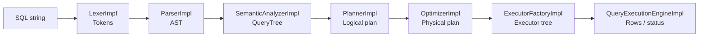

# SQL pipeline

Этот документ описывает путь SQL‑строки через стадии компиляции и подготовки к исполнению.

## Общая схема

## 1) Lexer (лексический анализ)

Файл: `src/main/java/ru/open/cu/student/lexer/LexerImpl.java`

Задача:

- преобразовать входную строку в поток токенов (ключевые слова, идентификаторы, литералы, операторы);
- обеспечить предсказуемые ошибки на уровне лексики.

## 2) Parser (синтаксический анализ)

Файл: `src/main/java/ru/open/cu/student/parser/ParserImpl.java`

Задача:

- построить абстрактное синтаксическое дерево (AST),
- гарантировать корректность грамматики для поддерживаемого диалекта.

AST‑узлы расположены в `src/main/java/ru/open/cu/student/parser/nodes/`.

## 3) Semantic analyzer (семантический анализ)

Файл: `src/main/java/ru/open/cu/student/semantic/SemanticAnalyzerImpl.java`

Задача:

- проверить существование таблиц и колонок,
- выполнить разрешение имён и базовую типизацию выражений,
- сформировать `QueryTree` — типизированное представление запроса.

## 4) Planner (логическое планирование)

Файл: `src/main/java/ru/open/cu/student/planner/PlannerImpl.java`

Задача:

- построить логический план (дерево операторов: scan/filter/project/insert/create),
- отделить “что хотим сделать” от “как именно будем исполнять”.

Узлы логического плана: `src/main/java/ru/open/cu/student/planner/node/`.

## 5) Optimizer (физическое планирование)

Файл: `src/main/java/ru/open/cu/student/optimizer/OptimizerImpl.java`

Текущая стратегия — rule‑based выбор сканирования:

- `SeqScan` (полный перебор) по умолчанию,
- `IndexScan`, если по предикату можно применить индекс.

Ключевое правило выбора: `optimizer/strategy/RuleBasedScanStrategy.java`.

Узлы физического плана: `src/main/java/ru/open/cu/student/optimizer/node/`.

## 6) Executor factory (построение дерева исполнителей)

Файл: `src/main/java/ru/open/cu/student/execution/ExecutorFactoryImpl.java`

Задача:

- сопоставить физические узлы плана с исполнителями;
- подготовить дерево Volcano‑исполнителей.

## 7) Execution engine (исполнение)

Файл: `src/main/java/ru/open/cu/student/execution/QueryExecutionEngineImpl.java`

Задача:

- вызвать `open()` у корневого исполнителя,
- последовательно получать строки через `next()`,
- корректно завершить выполнение и сформировать `QueryResult`.

## Обработка ошибок

Стадии pipeline разделены, что позволяет:

- возвращать ошибки с указанием этапа (`LEXER`, `PARSER`, `SEMANTIC`, `PLANNER`, `OPTIMIZER`, `EXECUTION`);
- удобнее тестировать негативные сценарии.

Формат ошибки и сетевой ответ описаны в `PROTOCOL.md`.

