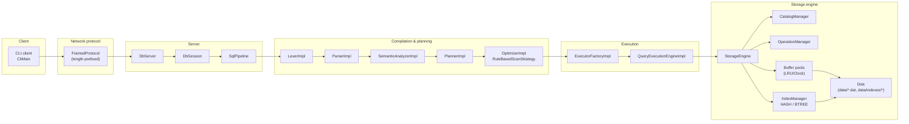
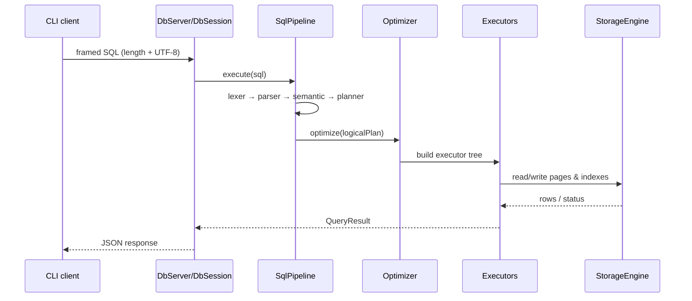

# Architecture

GEBODIKBD is a small educational DBMS split into clear modules:

- client (CLI),
- network protocol,
- server (sessions and request handling),
- SQL pipeline (compilation + planning + optimization),
- execution engine (plan execution),
- storage engine (catalog, storage, indexes).

This document provides a component overview, data flow, and key design decisions.

## Components and responsibilities

### Client

- `ru.open.cu.student.client.CliMain` — CLI entry point.
- `CliRenderer`, `PrettyTable` — result rendering.
- Optional: raw JSON output mode.

### Server and sessions

- `ru.open.cu.student.server.DbServer` — TCP server, accepts connections.
- `ru.open.cu.student.server.DbSession` — per-connection request/response lifecycle.

### SQL pipeline

- `ru.open.cu.student.pipeline.SqlPipeline` — orchestrates query processing stages.
- `LexerImpl` → `ParserImpl` → `SemanticAnalyzerImpl` → `PlannerImpl` → `OptimizerImpl`.
- Output: a physical plan suitable for execution.

### Execution engine

- `QueryExecutionEngineImpl` — iterative plan execution.
- `ExecutorFactoryImpl` — builds the executor tree (Volcano model).
- Executors live in `ru.open.cu.student.execution.executors`.

### Storage engine

- `ru.open.cu.student.storage.engine.StorageEngine` — façade and composition root for storage subsystems.
- `CatalogManager` — table/column/type metadata.
- `OperationManager` — data operations (insert/scan).
- `IndexManager` — index lifecycle and lookup.
- `BufferPoolRegistry` / `DefaultBufferPoolManager` — page cache.
- `HeapPageFileManager` / `HeapPage` — disk-backed storage.

## Diagrams

### High-level overview



### Single-query flow



## Key design decisions

### Volcano-style executors

Execution follows an iterative interface:

- `open()` — initialization
- `next()` — fetch next row (or `null` when exhausted)
- `close()` — resource cleanup

Benefits for an educational project:

- composability (scan → filter → project)
- lazy evaluation (no mandatory materialization)
- a natural hook for future optimizations

### Global query serialization

To keep concurrency out of scope, the server serializes queries via a global execution lock.
This is a deliberate trade-off: the project does not implement transactions, row-level locking, or MVCC.

### Separating compilation from execution

The SQL pipeline is a sequence of stages with clear responsibility boundaries:

- syntax (lexer/parser)
- semantics (name resolution, typing)
- logical plan
- physical plan (rule-based optimization)
- executors

This makes the code easier to test and read: each stage can be validated in isolation.

## Limitations (intentional)

- No transactions and no isolation model.
- No JOIN/ORDER BY/LIMIT (see `ROADMAP.md`).
- BTREE indexes are rebuilt by scanning the table on startup (persistence is not complete).

## Package layout

Below is an overview of the main packages (for quick code navigation):

```
src/main/java/ru/open/cu/student/
├── catalog/        # system catalog and metadata operations
├── client/         # CLI client
├── execution/      # Volcano executors + execution engine
├── index/          # indexes (hash, btree) and index manager
├── lexer/          # lexical analysis
├── memory/         # pages, buffer pool, serialization, page I/O
├── optimizer/      # physical plan and optimization rules
├── parser/         # AST and parser
├── pipeline/       # orchestration of query processing stages
├── planner/        # logical plan
├── protocol/       # framed protocol and JSON helpers
├── semantic/       # semantic analysis and typed expressions
├── server/         # TCP server and sessions
└── storage/        # tables and storage engine composition
```


