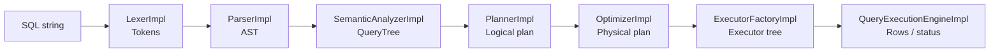

# SQL pipeline

This document describes how a SQL string moves through compilation stages and becomes an executable plan.

## Общая схема

## 1) Lexer (lexical analysis)

File: `src/main/java/ru/open/cu/student/lexer/LexerImpl.java`

Responsibilities:

- transform the input string into a token stream (keywords, identifiers, literals, operators)
- provide predictable lexical-level errors

## 2) Parser (syntax analysis)

File: `src/main/java/ru/open/cu/student/parser/ParserImpl.java`

Responsibilities:

- build an abstract syntax tree (AST)
- enforce the supported grammar rules for the dialect

AST node types live under `src/main/java/ru/open/cu/student/parser/nodes/`.

## 3) Semantic analyzer

File: `src/main/java/ru/open/cu/student/semantic/SemanticAnalyzerImpl.java`

Responsibilities:

- validate tables and columns exist
- perform name resolution and basic expression typing
- build `QueryTree` — a typed representation of the query

## 4) Planner (logical planning)

File: `src/main/java/ru/open/cu/student/planner/PlannerImpl.java`

Responsibilities:

- build a logical plan (operators: scan/filter/project/insert/create)
- separate “what to do” from “how to execute”

Logical plan nodes: `src/main/java/ru/open/cu/student/planner/node/`.

## 5) Optimizer (physical planning)

File: `src/main/java/ru/open/cu/student/optimizer/OptimizerImpl.java`

Current strategy: a rule-based scan selection:

- `SeqScan` by default
- `IndexScan` when the predicate can leverage an index

Main rule entry point: `optimizer/strategy/RuleBasedScanStrategy.java`.

Physical plan nodes: `src/main/java/ru/open/cu/student/optimizer/node/`.

## 6) Executor factory (building the executor tree)

File: `src/main/java/ru/open/cu/student/execution/ExecutorFactoryImpl.java`

Responsibilities:

- map physical plan nodes to executor implementations
- construct a Volcano-style executor tree

## 7) Execution engine

File: `src/main/java/ru/open/cu/student/execution/QueryExecutionEngineImpl.java`

Responsibilities:

- call `open()` on the root executor
- iteratively pull rows via `next()`
- finalize execution and produce a `QueryResult`

## Error handling

Stages are separated, which makes it possible to:

- return errors annotated with the stage (`LEXER`, `PARSER`, `SEMANTIC`, `PLANNER`, `OPTIMIZER`, `EXECUTION`)
- test negative scenarios more easily

The error format and network response are described in `PROTOCOL.md`.

